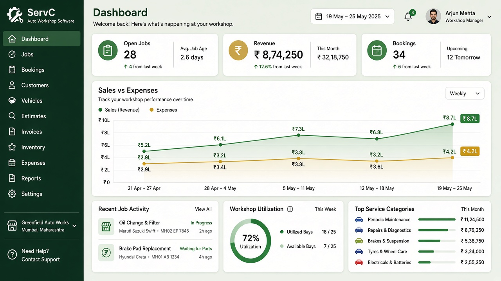
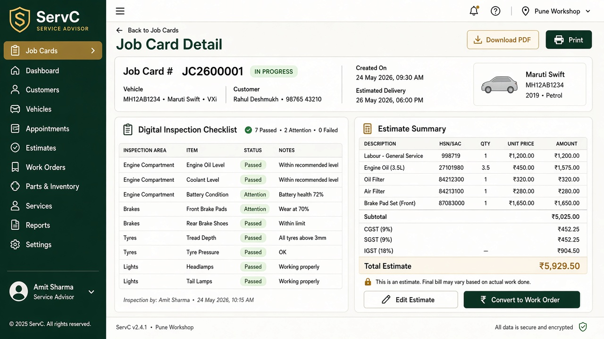
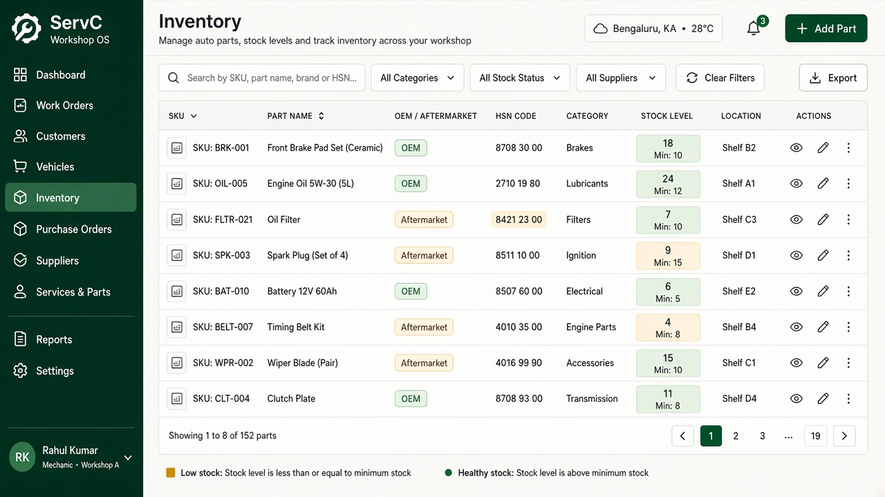

# ServC Auto India

**Workshop operating system for multi-brand Indian automobile service centres.**

ServC covers the full loop from booking → digital job card → WhatsApp estimate approval → repair → GST invoice → UPI payment — with role-based access for owners, advisors, technicians, inventory, accounts, and customers.

| | |
|---|---|
| **Product site** | [GitHub Pages](https://remo-consultants.github.io/ServC/) |
| **Role demos** | [Journey gallery](https://remo-consultants.github.io/ServC/demo.html) |
| **Repository** | [Remo-Consultants/ServC](https://github.com/Remo-Consultants/ServC) |

---

## Why ServC

Indian multi-brand workshops juggle WhatsApp quotes, paper job cards, GST invoices, UPI settlements, and parts from OEM / aftermarket / local market — often across spreadsheets. ServC is a tenant-aware Next.js app that keeps that work on one floor:

- **India-first** — vehicle registration validation, PUC/insurance tracking, mobile OTP, GSTIN, CGST/SGST/IGST, UPI QR
- **RBAC** — Super Admin, Owner, Branch Manager, Service Advisor, Technician, Inventory Manager, Accountant, Customer
- **Acceptance flow** — Book → Inspect → Approve (WhatsApp) → Repair → Pay
- **Ops analytics** — sales vs OpEx trends, bay/job mix, technician load, GST month summaries

---

## Screenshots

<p align="center">
  
</p>

| Owner dashboard | Advisor job card | Inventory |
| --- | --- | --- |
|  |  |  |

More role journeys (technician inspection, GST accounts, customer estimate + UPI): **[open the demo gallery →](https://remo-consultants.github.io/ServC/demo.html)**

---

## Acceptance journey

```text
Book  →  Inspect  →  Approve (WhatsApp)  →  Repair  →  Pay (GST + UPI)
```

1. **Book** — online portal or walk-in; collision-aware slots  
2. **Inspect** — digital checklist: Passed / Attention / Critical  
3. **Approve** — line-item estimate with HSN/SAC; customer approves on WhatsApp  
4. **Repair** — technicians update through Quality Check → Ready  
5. **Pay** — GST invoice; UPI / cash / card; partials supported  

---

## Stack

| Layer | Choice |
| --- | --- |
| App | Next.js 15 (App Router), React 19, TypeScript |
| UI | Tailwind CSS 4, Recharts |
| Data | Prisma 5.22 · SQLite (dev) · Postgres (Docker) |
| Auth | JWT + password · mobile OTP (demo fixed OTP) |
| Mobile | Expo app under `mobile/` |

---

## Quick start

```bash
git clone https://github.com/Remo-Consultants/ServC.git
cd ServC
cp .env.example .env
npm install
npx prisma db push
npm run db:seed
npm run dev
```

Open **http://127.0.0.1:4317**

### Demo credentials

| Role | Login | Password |
| --- | --- | --- |
| Owner | `owner@servc.in` | `ServC@123` |
| Branch Manager | `manager@servc.in` | `ServC@123` |
| Service Advisor | `advisor@servc.in` | `ServC@123` |
| Technician | `tech1@servc.in` | `ServC@123` |
| Inventory | `inventory@servc.in` | `ServC@123` |
| Accountant | `accounts@servc.in` | `ServC@123` |
| Super Admin | `admin@servc.in` | `ServC@123` |
| Customer (OTP) | Mobile `9876543210` | OTP `123456` (demo mode) |

---

## Product capabilities

### Workshop floor
- Omnichannel bookings and walk-ins  
- Digital check-in with registration / odometer / PUC  
- Job cards: Requested → In Progress → Quality Check → Ready  
- Bay utilisation and technician assignment  

### Estimates & WhatsApp
- Labour + parts line items with HSN/SAC  
- Versioned estimates; customer approve / reject before work  
- Portal deep-link for estimate review  

### GST & payments
- Place-of-supply aware CGST/SGST or IGST  
- Customer GSTIN for ITC on invoices  
- UPI QR / payment intents, partial payments  
- GSTR-1 style month summaries  

### Inventory
- OEM · Aftermarket · Local market catalogue  
- Branch stock, low-stock alerts, purchase orders  
- Consumption tied to approved job cards  

### Analytics
- Six-month sales vs OpEx  
- Category OpEx breakdown  
- Open jobs, revenue MTD, GST health  

---

## Project layout

```text
src/app/          # Marketing home, /login, /dashboard/*, /portal/*
src/components/   # Shell, charts, UI primitives
prisma/           # Schema + rich demo seed
docs/             # GitHub Pages product site + guides
mobile/           # Expo companion
docker-compose.yml
```

### Docs & guides

- [Product website](docs/index.html)  
- [Role demo gallery](docs/demo.html)  
- [User manual](docs/guides/USER_MANUAL.md)  
- [API overview](docs/guides/API.md)  

### Scripts

| Command | Description |
| --- | --- |
| `npm run dev` | Dev server on port **4317** |
| `npm run build` / `npm start` | Production build / serve |
| `npm run db:push` | Push Prisma schema |
| `npm run db:seed` | Seed demo company, jobs, invoices, OpEx |
| `npm run db:studio` | Prisma Studio |
| `npm run mobile` | Start Expo app |

### Docker (Postgres)

```bash
docker compose up -d
# point DATABASE_URL in .env at the Postgres service, then:
npx prisma db push && npm run db:seed
```

---

## GitHub Pages

The static product site lives under `docs/`:

1. Repo **Settings → Pages**  
2. Source: **Deploy from a branch**  
3. Branch: `main` (or default) · Folder: `/docs`  

Site URL: `https://remo-consultants.github.io/ServC/`

---

## Security notes

- Demo passwords and OTP are for local/demo only — rotate before any shared environment  
- JWT secret and DB URL come from `.env` (see `.env.example`)  
- Never commit real WhatsApp / payment provider credentials  

---

## Credits

**ServC Auto India** is designed and built by **Dinesh V Sundaram** ([Remo-Consultants](https://github.com/Remo-Consultants)).

All product concept, architecture, UI, and documentation credit belongs to Dinesh V Sundaram.

## License

Proprietary — © 2026 Dinesh V Sundaram / Remo Consultants. All rights reserved unless otherwise stated.
